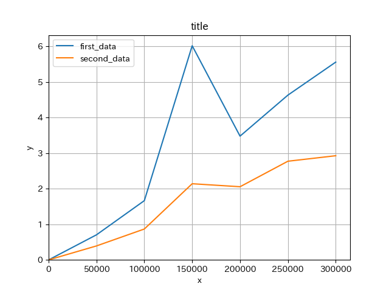

## <!-- fit --> タイトル

作成日　2025年3月　 
すばる

---

# 目次

-  トピック1
-  トピック2
-  トピック3

---

#### 

### トピック1

---

#  トピック1

    

        1.遅れて
    

    

        2.コメントが来る
    

---
# 目次

-  トピック1
-  トピック2
-  トピック3

---

#### 

### トピック2

---

#  トピック2

    

    写真とか追加できる
    

    

    (ちっちゃい地蔵)
    

---
# 目次

-  トピック1
-  トピック2
-  トピック3

---

#### 

### トピック3

---

#  トピック3

    

    ラーメンは
    

    

    おいしい
    

---
# グラフ

    結果!

---

    

    まとめ
    

